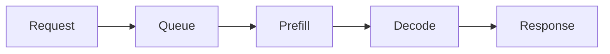

# V1 Astro Site Implementation Plan

> **For agentic workers:** REQUIRED SUB-SKILL: Use superpowers:subagent-driven-development (recommended) or superpowers:executing-plans to implement this plan task-by-task. Steps use checkbox (`- [ ]`) syntax for tracking.

**Goal:** Build the v1 Jay Baek.dev static editorial site from the active `DESIGN.md`, including Records, Build, About, Search, content collections, content graph behavior, and GitHub Pages deployment.

**Architecture:** Use Astro as a static content site. Keep authored content in Astro collections named `writing`, `projects`, and `series`, but expose public routes and navigation as `Records`, `Build`, `About`, and `/search/`. Centralize content sorting, filtering, tags, featured selection, and relationship composition in `src/lib/content/graph.ts`; keep pages thin and UI components presentational.

**Tech Stack:** Astro, TypeScript, Astro content collections, Vitest, Pagefind, Mermaid, GitHub Actions, CSS custom properties from `DESIGN.md`.

---

## Source Of Truth

Read these files before implementing:

- `DESIGN.md`: visual/UI source of truth, route labels, states, responsive and accessibility rules.
- `docs/architecture.md`: module map and folder ownership rules.
- `docs/content-guide.md`: frontmatter requirements and authoring model.
- `docs/validation.md`: required test, build, and QA checks.
- `docs/deployment.md`: GitHub Pages target and `site`/`base` assumptions.

Public labels and routes:

- `/` is Home.
- `/records/` is the archive for `writing` collection entries.
- `/records/[slug]/` is a Record detail page.
- `/build/` is the focused Build thread over `projects` collection entries.
- `/build/[slug]/` exists only when generated from project entries.
- `/about/` is professional context and contact.
- `/search/` is static Records search.
- `/tags/[tag]/` and `/series/[slug]/` are Records discovery routes.

Internal collection names stay `writing`, `projects`, and `series`.

## File Structure

Create:

- `package.json`: scripts, dependencies, and dev dependencies.
- `tsconfig.json`: strict TypeScript config using Astro defaults.
- `astro.config.mjs`: static output, GitHub Pages `site`, no `base` for `jaybaek.github.io`.
- `.gitignore`: Node and build outputs.
- `.github/workflows/deploy.yml`: GitHub Pages deployment.
- `src/content.config.ts`: Astro content collection schemas.
- `src/config/site.ts`: identity, thesis copy, profile links, SEO defaults.
- `src/config/navigation.ts`: public nav items.
- `src/config/tags.ts`: controlled tags and focus groups.
- `src/styles/global.css`: design tokens, base typography, layout, content styles, state styles.
- `src/layouts/BaseLayout.astro`: document shell, header, footer, metadata.
- `src/layouts/ContentLayout.astro`: article/detail shell with optional Mermaid handling.
- `src/components/Header.astro`: brand, nav, search icon.
- `src/components/Footer.astro`: quiet site footer.
- `src/components/RecordList.astro`: repeated Record rows/cards.
- `src/components/RecordFilters.astro`: client-side Records filter controls.
- `src/components/BuildSummary.astro`: focused Build thread presentation.
- `src/components/EmptyState.astro`: shared empty state pattern.
- `src/components/TagList.astro`: compact tags.
- `src/lib/content/graph.ts`: public content graph interface and pure preparation helpers.
- `src/lib/content/graph.test.ts`: Vitest coverage for observable graph behavior.
- `src/pages/index.astro`: Home.
- `src/pages/records/index.astro`: Records archive.
- `src/pages/records/[...slug].astro`: Record detail.
- `src/pages/build/index.astro`: Build page.
- `src/pages/build/[...slug].astro`: Build detail generated from projects.
- `src/pages/about.astro`: About.
- `src/pages/search.astro`: Pagefind search UI.
- `src/pages/tags/[tag].astro`: tag route.
- `src/pages/series/[slug].astro`: series route.
- `src/pages/404.astro`: useful 404.
- `src/content/writing/llm-serving-latency.md`: published sample Record with Mermaid.
- `src/content/writing/system-design-queues.md`: published sample Record.
- `src/content/writing/draft-private-note.md`: draft exclusion fixture.
- `src/content/projects/inference-notes-build.md`: Build thread sample.
- `src/content/series/practical-ai-systems.md`: sample series.

Modify:

- `DESIGN.md`: only if implementation reveals a design decision that must be recorded.
- `docs/validation.md`: only if commands or route names change.

Do not modify generated build outputs or `dist/`.

## Task 1: Project Foundation And Design Tokens

**Files:**

- Create: `package.json`
- Create: `.prettierrc`
- Create: `tsconfig.json`
- Create: `astro.config.mjs`
- Create: `.gitignore`
- Create: `src/config/site.ts`
- Create: `src/config/navigation.ts`
- Create: `src/config/tags.ts`
- Create: `src/styles/global.css`
- Create: `src/layouts/BaseLayout.astro`
- Create: `src/components/Header.astro`
- Create: `src/components/Footer.astro`

- [ ] **Step 1: Create project package scripts**

Write `package.json`:

```json
{
  "name": "jaybaek-dev",
  "version": "0.1.0",
  "private": true,
  "type": "module",
  "scripts": {
    "dev": "astro dev",
    "start": "astro dev",
    "test": "vitest run --passWithNoTests",
    "test:watch": "vitest",
    "astro": "astro",
    "build": "astro build && if find dist -name '*.html' -type f | grep -q .; then pagefind --site dist; else echo 'No HTML files found; skipping Pagefind.'; fi",
    "preview": "astro preview",
    "format": "prettier --write \"src/**/*.{astro,css,ts}\" \"*.{js,json,mjs,ts}\" \".github/**/*.yml\" --ignore-unknown --no-error-on-unmatched-pattern",
    "lint": "prettier --check \"src/**/*.{astro,css,ts}\" \"*.{js,json,mjs,ts}\" \".github/**/*.yml\" --ignore-unknown --no-error-on-unmatched-pattern"
  },
  "dependencies": {
    "astro": "6.1.10"
  },
  "devDependencies": {
    "@astrojs/check": "0.9.9",
    "pagefind": "1.5.2",
    "prettier": "3.8.3",
    "prettier-plugin-astro": "0.14.1",
    "typescript": "5.9.3",
    "vitest": "4.1.5"
  }
}
```

Write `.prettierrc`:

```json
{
  "plugins": ["prettier-plugin-astro"]
}
```

- [ ] **Step 2: Install dependencies**

Run:

```bash
npm install
```

Expected: `package-lock.json` is created and npm exits successfully.

- [ ] **Step 3: Create TypeScript and Astro config**

Write `tsconfig.json`:

```json
{
  "extends": "astro/tsconfigs/strict",
  "compilerOptions": {
    "types": ["vitest/globals"]
  }
}
```

Write `astro.config.mjs`:

```js
import { defineConfig } from "astro/config";

const site = "https://jaybaek.github.io";

export default defineConfig({
  site,
  output: "static",
});
```

- [ ] **Step 4: Ignore local and generated files**

Write `.gitignore`:

```gitignore
node_modules/
dist/
.astro/
.DS_Store
coverage/
```

- [ ] **Step 5: Create site identity config**

Write `src/config/site.ts`:

```ts
export const site = {
  name: "Jay Baek.dev",
  title: "Jay Baek.dev",
  description:
    "A learning-forward engineering dossier for practical AI systems, study notes, engineering memos, and one focused build thread.",
  url: "https://jaybaek.github.io",
  author: "Jay Baek",
  role: "AI Engineer",
  thesisKo: "실전 문제를 AI 시스템으로 바꾸고, 그 과정을 기록으로 증명합니다.",
  thesisEn:
    "Building toward practical AI systems through study notes, engineering memos, and one focused open-source build thread.",
  links: [{ label: "GitHub", href: "https://github.com/Oswa1d99" }],
} as const;
```

Write `src/config/navigation.ts`:

```ts
export const navigation = [
  { label: "Records", href: "/records/" },
  { label: "Build", href: "/build/" },
  { label: "About", href: "/about/" },
] as const;
```

Write `src/config/tags.ts`:

```ts
export const tagDefinitions = {
  "llm-serving": { label: "LLM serving", role: "focus" },
  "system-design": { label: "System design", role: "focus" },
  "cs-fundamentals": { label: "CS fundamentals", role: "focus" },
  "ai-engineering": { label: "AI engineering", role: "focus" },
  latency: { label: "Latency", role: "topic" },
  evaluation: { label: "Evaluation", role: "topic" },
  queues: { label: "Queues", role: "topic" },
  indexing: { label: "Indexing", role: "topic" },
  network: { label: "Network", role: "topic" },
  agents: { label: "Agents", role: "topic" },
  "study-note": { label: "Study note", role: "format" },
  "engineering-memo": { label: "Engineering memo", role: "format" },
  diagram: { label: "Diagram", role: "format" },
  reflection: { label: "Reflection", role: "format" },
  "build-log": { label: "Build log", role: "format" }
} as const;

export type TagSlug = keyof typeof tagDefinitions;

export const tagSlugs = Object.keys(tagDefinitions) as TagSlug[];

export const focusGroups = [
  {
    label: "LLM serving",
    slug: "llm-serving",
    tags: ["llm-serving", "latency", "evaluation"] satisfies TagSlug[],
  },
  {
    label: "System design",
    slug: "system-design",
    tags: ["system-design", "queues", "indexing", "network"] satisfies TagSlug[],
  },
  {
    label: "AI engineering practice",
    slug: "ai-engineering",
    tags: ["ai-engineering", "agents", "build-log"] satisfies TagSlug[],
  },
] as const;

export function getTagLabel(tag: string): string {
  return tagDefinitions[tag as TagSlug]?.label ?? tag;
}
```

- [ ] **Step 6: Create global CSS from DESIGN.md**

Write `src/styles/global.css` with tokens and base styles:

```css
:root {
  --color-bg: #fffdf8;
  --color-surface: #ffffff;
  --color-surface-soft: #f7f3ea;
  --color-text: #1a1714;
  --color-text-muted: #716a61;
  --color-text-faint: #9a9187;
  --color-border: #e3ded3;
  --color-border-strong: #b9b0a3;
  --color-link: #1f4f7a;
  --color-link-visited: #5b467c;
  --color-focus: #0b6bfa;
  --color-success: #2f6b4f;
  --color-warning: #8a5a12;
  --color-error: #9b2f2f;
  --font-body: Pretendard, "Apple SD Gothic Neo", "Noto Sans KR", sans-serif;
  --font-display: Pretendard, "Apple SD Gothic Neo", "Noto Sans KR", sans-serif;
  --font-mono: "IBM Plex Mono", "JetBrains Mono", ui-monospace, monospace;
  --space-2xs: 2px;
  --space-xs: 4px;
  --space-sm: 8px;
  --space-md: 16px;
  --space-lg: 24px;
  --space-xl: 32px;
  --space-2xl: 48px;
  --space-3xl: 64px;
  --radius-control: 4px;
  --radius-tag: 6px;
  --radius-card: 8px;
}

* {
  box-sizing: border-box;
}

html {
  background: var(--color-bg);
  color: var(--color-text);
  font-family: var(--font-body);
  font-size: 16px;
  line-height: 1.6;
}

body {
  margin: 0;
  min-width: 320px;
}

a {
  color: var(--color-link);
  text-decoration-color: currentColor;
  text-underline-offset: 0.18em;
}

a:visited {
  color: var(--color-link-visited);
}

a:focus-visible,
button:focus-visible,
input:focus-visible,
select:focus-visible {
  outline: 2px solid var(--color-focus);
  outline-offset: 3px;
}

img,
svg {
  max-width: 100%;
}

button,
input,
select {
  font: inherit;
}

.page-frame {
  width: min(100% - 32px, 900px);
  margin: 0 auto;
}

.records-frame {
  width: min(100% - 32px, 960px);
  margin: 0 auto;
}

.reading-frame {
  width: min(100% - 32px, 740px);
  margin: 0 auto;
}

.site-header {
  border-bottom: 1px solid var(--color-border);
  background: color-mix(in srgb, var(--color-bg) 92%, white);
}

.site-header__inner {
  display: flex;
  align-items: center;
  gap: var(--space-md);
  min-height: 64px;
  padding: var(--space-sm) 0;
}

.site-brand {
  color: var(--color-text);
  font-weight: 700;
  text-decoration: none;
}

.site-nav {
  display: flex;
  flex: 1;
  align-items: center;
  justify-content: flex-end;
  gap: var(--space-md);
}

.site-nav a {
  color: var(--color-text-muted);
  font-size: 14px;
  font-weight: 600;
  text-decoration: none;
}

.site-nav a[aria-current="page"] {
  color: var(--color-text);
  text-decoration: underline;
}

.search-link {
  display: inline-flex;
  align-items: center;
  justify-content: center;
  width: 36px;
  height: 36px;
  border: 1px solid var(--color-border);
  border-radius: var(--radius-control);
  color: var(--color-text);
  text-decoration: none;
}

.site-footer {
  margin-top: var(--space-3xl);
  border-top: 1px solid var(--color-border);
  color: var(--color-text-muted);
  font-size: 14px;
}

.site-footer__inner {
  padding: var(--space-lg) 0;
}

.eyebrow,
.meta,
.tag {
  font-family: var(--font-mono);
  font-size: 12px;
}

.tag-list {
  display: flex;
  flex-wrap: wrap;
  gap: var(--space-sm);
  margin: 0;
  padding: 0;
  list-style: none;
}

.tag {
  display: inline-flex;
  border: 1px solid var(--color-border);
  border-radius: var(--radius-tag);
  padding: var(--space-2xs) var(--space-sm);
  color: var(--color-text-muted);
  text-decoration: none;
}

.record-list {
  display: grid;
  gap: var(--space-md);
  margin: 0;
  padding: 0;
  list-style: none;
}

.record-card,
.build-panel,
.empty-state {
  border: 1px solid var(--color-border);
  border-radius: var(--radius-card);
  background: var(--color-surface);
  padding: var(--space-lg);
}

.record-card h2,
.record-card h3,
.build-panel h2,
.build-panel h3 {
  margin: 0 0 var(--space-sm);
  font-size: 22px;
  line-height: 1.3;
}

.record-card p,
.build-panel p,
.empty-state p {
  margin: 0;
  color: var(--color-text-muted);
}

.content-body {
  font-size: 16px;
}

.content-body h2,
.content-body h3 {
  margin-top: var(--space-2xl);
  line-height: 1.3;
}

.content-body pre {
  overflow-x: auto;
  border: 1px solid var(--color-border);
  border-radius: var(--radius-card);
  padding: var(--space-md);
  background: var(--color-surface-soft);
}

mark {
  background: #fff1a8;
  color: var(--color-text);
}

@media (max-width: 479px) {
  .site-header__inner {
    flex-wrap: wrap;
  }

  .site-nav {
    order: 3;
    justify-content: flex-start;
    width: 100%;
  }
}

@media (prefers-reduced-motion: reduce) {
  *,
  *::before,
  *::after {
    scroll-behavior: auto !important;
    transition-duration: 0.01ms !important;
    animation-duration: 0.01ms !important;
    animation-iteration-count: 1 !important;
  }
}
```

- [ ] **Step 7: Create BaseLayout, Header, and Footer**

Write `src/components/Header.astro`:

```astro
---
import { navigation } from "../config/navigation";
import { site } from "../config/site";

const currentPath = Astro.url.pathname;

function isCurrent(href: string) {
  return currentPath === href || currentPath.startsWith(href);
}
---

<header class="site-header">
  <div class="page-frame site-header__inner">
    <a class="site-brand" href="/">{site.name}</a>
    <nav class="site-nav" aria-label="Primary navigation">
      {navigation.map((item) => (
        <a href={item.href} aria-current={isCurrent(item.href) ? "page" : undefined}>
          {item.label}
        </a>
      ))}
      <a class="search-link" href="/search/" aria-label="Search records">
        <svg aria-hidden="true" width="17" height="17" viewBox="0 0 24 24" fill="none">
          <path d="m21 21-4.3-4.3m1.3-5.2a6.5 6.5 0 1 1-13 0 6.5 6.5 0 0 1 13 0Z" stroke="currentColor" stroke-width="2" stroke-linecap="round" />
        </svg>
      </a>
    </nav>
  </div>
</header>
```

Write `src/components/Footer.astro`:

```astro
---
import { site } from "../config/site";
---

<footer class="site-footer">
  <div class="page-frame site-footer__inner">
    <p>{site.name} keeps a public record of study, engineering memos, and focused build work.</p>
  </div>
</footer>
```

Write `src/layouts/BaseLayout.astro`:

```astro
---
import Header from "../components/Header.astro";
import Footer from "../components/Footer.astro";
import { site } from "../config/site";
import "../styles/global.css";

interface Props {
  title?: string;
  description?: string;
  lang?: string;
}

const pageTitle = Astro.props.title ? `${Astro.props.title} | ${site.name}` : site.title;
const description = Astro.props.description ?? site.description;
const lang = Astro.props.lang ?? "en";
---

<!doctype html>
<html lang={lang}>
  <head>
    <meta charset="utf-8" />
    <meta name="viewport" content="width=device-width, initial-scale=1" />
    <meta name="description" content={description} />
    <link rel="canonical" href={new URL(Astro.url.pathname, site.url)} />
    <title>{pageTitle}</title>
  </head>
  <body>
    <Header />
    <main id="main">
      <slot />
    </main>
    <Footer />
  </body>
</html>
```

- [ ] **Step 8: Verify foundation**

Run:

```bash
npm run astro check
```

Expected: passes for the foundation with no errors.

- [ ] **Step 9: Commit foundation**

```bash
git add package.json package-lock.json tsconfig.json astro.config.mjs .gitignore src/config src/styles src/layouts/BaseLayout.astro src/components/Header.astro src/components/Footer.astro
git commit -m "feat: scaffold Astro site foundation"
```

## Task 2: Content Collections And Content Graph

**Files:**

- Create: `src/content.config.ts`
- Create: `src/content/writing/llm-serving-latency.md`
- Create: `src/content/writing/system-design-queues.md`
- Create: `src/content/writing/draft-private-note.md`
- Create: `src/content/projects/inference-notes-build.md`
- Create: `src/content/series/practical-ai-systems.md`
- Create: `src/lib/content/graph.ts`
- Create: `src/lib/content/graph.test.ts`

- [ ] **Step 1: Define content schemas**

Write `src/content.config.ts`:

```ts
import { defineCollection, reference } from "astro:content";
import { glob } from "astro/loaders";
import { z } from "astro/zod";
import { tagSlugs } from "./config/tags";

const tagEnum = z.enum(tagSlugs as [string, ...string[]]);

const writing = defineCollection({
  loader: glob({ base: "./src/content/writing", pattern: "**/*.{md,mdx}" }),
  schema: z.object({
    title: z.string(),
    description: z.string(),
    publishedAt: z.coerce.date(),
    updatedAt: z.coerce.date().optional(),
    draft: z.boolean().default(false),
    tags: z.array(tagEnum).default([]),
    series: reference("series").optional(),
    relatedProjects: z.array(reference("projects")).default([]),
    language: z.enum(["ko", "en", "mixed"]).default("mixed"),
    featured: z.boolean().default(false),
    primaryLabel: z.string().optional(),
  }),
});

const projects = defineCollection({
  loader: glob({ base: "./src/content/projects", pattern: "**/*.{md,mdx}" }),
  schema: z.object({
    title: z.string(),
    description: z.string(),
    status: z.enum(["Exploring", "Building", "Maintained", "Paused"]),
    featured: z.boolean().default(false),
    stack: z.array(z.string()).default([]),
    githubUrl: z.url().optional(),
    demoUrl: z.url().optional(),
    startedAt: z.coerce.date(),
    updatedAt: z.coerce.date(),
    tags: z.array(tagEnum).default([]),
    relatedWriting: z.array(reference("writing")).default([]),
  }),
});

const series = defineCollection({
  loader: glob({ base: "./src/content/series", pattern: "**/*.{md,mdx}" }),
  schema: z.object({
    title: z.string(),
    description: z.string(),
    status: z.enum(["Active", "Paused", "Complete"]).default("Active"),
    featured: z.boolean().default(false),
  }),
});

export const collections = { writing, projects, series };
```

- [ ] **Step 2: Add sample content**

Write `src/content/series/practical-ai-systems.md`:

```markdown
---
title: Practical AI Systems
description: Notes and memos about turning AI capability into maintainable systems.
status: Active
featured: true
---

This series tracks the path from model capability to useful production behavior.
```

Write `src/content/writing/llm-serving-latency.md`:

````markdown
---
title: LLM Serving Latency Notes
description: A compact note on the latency budget behind practical LLM serving.
publishedAt: 2026-04-29
updatedAt: 2026-04-29
draft: false
tags:
  - llm-serving
  - latency
  - evaluation
  - study-note
  - diagram
series: practical-ai-systems
relatedProjects:
  - inference-notes-build
language: mixed
featured: true
primaryLabel: LLM serving
---

## Question

Where does latency hide in a practical LLM request path?

## Current understanding

Latency is not one number. It is a chain: request validation, queueing, prefill, decode, post-processing, and delivery back to the user.



## Next learning step

Compare the latency profile of a tiny local model with a hosted API request.
````

Write `src/content/writing/system-design-queues.md`:

```markdown
---
title: Queue Notes For System Design
description: A short memo on why queues are a pressure boundary, not just plumbing.
publishedAt: 2026-04-28
updatedAt: 2026-04-29
draft: false
tags:
  - system-design
  - queues
  - engineering-memo
series: practical-ai-systems
relatedProjects:
  - inference-notes-build
language: mixed
featured: true
primaryLabel: System design
---

## Question

What does a queue protect in a small AI system?

## Current understanding

A queue gives the system a place to absorb bursts, make retry behavior explicit, and separate user-facing latency from background work.
```

Write `src/content/writing/draft-private-note.md`:

```markdown
---
title: Draft Private Note
description: This draft exists to verify draft exclusion.
publishedAt: 2026-04-27
draft: true
tags:
  - reflection
language: mixed
featured: false
---

This draft should never appear in public lists.
```

Write `src/content/projects/inference-notes-build.md`:

```markdown
---
title: Inference Notes Build
description: A focused public build thread for turning AI systems study into runnable notes and experiments.
status: Building
featured: true
stack:
  - Astro
  - TypeScript
  - Local experiments
githubUrl: https://github.com/Oswa1d99
startedAt: 2026-04-28
updatedAt: 2026-04-29
tags:
  - ai-engineering
  - build-log
  - llm-serving
relatedWriting:
  - llm-serving-latency
  - system-design-queues
---

## Problem

Study notes become more useful when they connect to a concrete build thread.

## Approach

Keep one public build surface that states what works now, what is unfinished, and which Records explain the technical path.

## Current Status

The first version is a structured public thread. Experiments and deeper artifacts will be added as they become real.

## Technical Notes

The Build page should stay honest about unfinished work and should point readers toward Records for depth.
```

- [ ] **Step 3: Write graph tests first**

Write `src/lib/content/graph.test.ts`:

```ts
import { describe, expect, it } from "vitest";
import {
  buildTagIndex,
  getFeaturedWriting,
  getHomeSelection,
  getProjectsForBuild,
  getRecordsForSeries,
  getRecordsForTag,
  prepareWritingEntries,
  type ProjectEntryLike,
  type SeriesEntryLike,
  type WritingEntryLike,
} from "./graph";

const writing: WritingEntryLike[] = [
  {
    id: "published-new",
    collection: "writing",
    data: {
      title: "Published New",
      description: "New public record",
      publishedAt: new Date("2026-04-29"),
      updatedAt: new Date("2026-04-29"),
      draft: false,
      tags: ["llm-serving", "latency", "study-note"],
      series: { collection: "series", id: "series-one" },
      relatedProjects: [{ collection: "projects", id: "project-one" }],
      language: "mixed",
      featured: true,
      primaryLabel: "LLM serving",
    },
  },
  {
    id: "published-old",
    collection: "writing",
    data: {
      title: "Published Old",
      description: "Old public record",
      publishedAt: new Date("2026-04-28"),
      draft: false,
      tags: ["system-design", "queues", "engineering-memo"],
      series: { collection: "series", id: "series-one" },
      relatedProjects: [],
      language: "mixed",
      featured: false,
    },
  },
  {
    id: "draft",
    collection: "writing",
    data: {
      title: "Draft",
      description: "Draft",
      publishedAt: new Date("2026-04-30"),
      draft: true,
      tags: ["reflection"],
      relatedProjects: [],
      language: "mixed",
      featured: true,
    },
  },
];

const projects: ProjectEntryLike[] = [
  {
    id: "project-one",
    collection: "projects",
    data: {
      title: "Project One",
      description: "Build thread",
      status: "Building",
      featured: true,
      stack: ["Astro"],
      startedAt: new Date("2026-04-28"),
      updatedAt: new Date("2026-04-29"),
      tags: ["ai-engineering", "build-log"],
      relatedWriting: [{ collection: "writing", id: "published-new" }],
    },
  },
];

const series: SeriesEntryLike[] = [
  {
    id: "series-one",
    collection: "series",
    data: {
      title: "Series One",
      description: "Series",
      status: "Active",
      featured: true,
    },
  },
];

describe("content graph", () => {
  it("excludes drafts and sorts published records newest first", () => {
    const records = prepareWritingEntries(writing);
    expect(records.map((entry) => entry.id)).toEqual(["published-new", "published-old"]);
  });

  it("orders featured writing predictably", () => {
    const featured = getFeaturedWriting(writing);
    expect(featured.map((entry) => entry.id)).toEqual(["published-new"]);
  });

  it("builds a stable tag index without draft metadata", () => {
    const index = buildTagIndex(writing, projects);
    expect(index.map((item) => item.slug)).toContain("llm-serving");
    expect(index.find((item) => item.slug === "reflection")?.count).toBeUndefined();
  });

  it("filters Records by tag", () => {
    expect(getRecordsForTag(writing, "queues").map((entry) => entry.id)).toEqual(["published-old"]);
  });

  it("orders Records in a series by published date", () => {
    expect(getRecordsForSeries(writing, "series-one").map((entry) => entry.id)).toEqual([
      "published-old",
      "published-new",
    ]);
  });

  it("returns featured Build entries newest first", () => {
    expect(getProjectsForBuild(projects).map((entry) => entry.id)).toEqual(["project-one"]);
  });

  it("creates stable Home selection with available content", () => {
    const home = getHomeSelection({ writing, projects, series });
    expect(home.records.map((entry) => entry.id)).toEqual(["published-new", "published-old"]);
    expect(home.build?.id).toBe("project-one");
  });
});
```

- [ ] **Step 4: Run tests and verify failure**

Run:

```bash
npm run test -- src/lib/content/graph.test.ts
```

Expected: FAIL because `src/lib/content/graph.ts` does not exist.

- [ ] **Step 5: Implement content graph**

Write `src/lib/content/graph.ts`:

```ts
import { getCollection, getEntry, type CollectionEntry } from "astro:content";
import { getTagLabel, tagDefinitions, type TagSlug } from "../../config/tags";

type ReferenceLike = { collection: string; id: string };

export type WritingEntryLike = {
  id: string;
  collection: "writing";
  data: {
    title: string;
    description: string;
    publishedAt: Date;
    updatedAt?: Date;
    draft: boolean;
    tags: string[];
    series?: ReferenceLike;
    relatedProjects: ReferenceLike[];
    language: "ko" | "en" | "mixed";
    featured: boolean;
    primaryLabel?: string;
  };
};

export type ProjectEntryLike = {
  id: string;
  collection: "projects";
  data: {
    title: string;
    description: string;
    status: "Exploring" | "Building" | "Maintained" | "Paused";
    featured: boolean;
    stack: string[];
    githubUrl?: string;
    demoUrl?: string;
    startedAt: Date;
    updatedAt: Date;
    tags: string[];
    relatedWriting: ReferenceLike[];
  };
};

export type SeriesEntryLike = {
  id: string;
  collection: "series";
  data: {
    title: string;
    description: string;
    status: "Active" | "Paused" | "Complete";
    featured: boolean;
  };
};

export type HomeSelection = {
  records: WritingEntryLike[];
  build?: ProjectEntryLike;
  series: SeriesEntryLike[];
};

export type TagIndexItem = {
  slug: string;
  label: string;
  count: number;
};

function byNewestWriting(a: WritingEntryLike, b: WritingEntryLike) {
  return b.data.publishedAt.getTime() - a.data.publishedAt.getTime();
}

function byOldestWriting(a: WritingEntryLike, b: WritingEntryLike) {
  return a.data.publishedAt.getTime() - b.data.publishedAt.getTime();
}

function byUpdatedProject(a: ProjectEntryLike, b: ProjectEntryLike) {
  return b.data.updatedAt.getTime() - a.data.updatedAt.getTime();
}

export function prepareWritingEntries(entries: WritingEntryLike[]) {
  return entries.filter((entry) => !entry.data.draft).sort(byNewestWriting);
}

export function getFeaturedWriting(entries: WritingEntryLike[], limit = 4) {
  return prepareWritingEntries(entries)
    .filter((entry) => entry.data.featured)
    .slice(0, limit);
}

export function getRecordsForTag(entries: WritingEntryLike[], tag: string) {
  return prepareWritingEntries(entries).filter((entry) => entry.data.tags.includes(tag));
}

export function getRecordsForSeries(entries: WritingEntryLike[], seriesId: string) {
  return prepareWritingEntries(entries)
    .filter((entry) => entry.data.series?.id === seriesId)
    .sort(byOldestWriting);
}

export function getProjectsForBuild(entries: ProjectEntryLike[]) {
  return [...entries].sort(byUpdatedProject);
}

export function buildTagIndex(writing: WritingEntryLike[], projects: ProjectEntryLike[] = []) {
  const counts = new Map<string, number>();

  for (const entry of prepareWritingEntries(writing)) {
    for (const tag of entry.data.tags) {
      counts.set(tag, (counts.get(tag) ?? 0) + 1);
    }
  }

  for (const entry of projects) {
    for (const tag of entry.data.tags) {
      counts.set(tag, (counts.get(tag) ?? 0) + 1);
    }
  }

  return [...counts.entries()]
    .filter(([slug]) => slug in tagDefinitions)
    .map(([slug, count]) => ({ slug, label: getTagLabel(slug), count }))
    .sort((a, b) => a.label.localeCompare(b.label));
}

export function getHomeSelection(input: {
  writing: WritingEntryLike[];
  projects: ProjectEntryLike[];
  series: SeriesEntryLike[];
}): HomeSelection {
  return {
    records: prepareWritingEntries(input.writing).slice(0, 4),
    build: getProjectsForBuild(input.projects).find((entry) => entry.data.featured) ?? getProjectsForBuild(input.projects)[0],
    series: input.series.filter((entry) => entry.data.featured),
  };
}

export function hasKnownTag(tag: string): tag is TagSlug {
  return tag in tagDefinitions;
}

export async function getAllRecords() {
  const entries = await getCollection("writing");
  return prepareWritingEntries(entries as WritingEntryLike[]);
}

export async function getAllBuildEntries() {
  const entries = await getCollection("projects");
  return getProjectsForBuild(entries as ProjectEntryLike[]);
}

export async function getAllSeries() {
  return (await getCollection("series")) as SeriesEntryLike[];
}

export async function getHomeContent() {
  const [writing, projects, series] = await Promise.all([
    getCollection("writing"),
    getCollection("projects"),
    getCollection("series"),
  ]);
  return getHomeSelection({
    writing: writing as WritingEntryLike[],
    projects: projects as ProjectEntryLike[],
    series: series as SeriesEntryLike[],
  });
}

export async function getTagIndex() {
  const [writing, projects] = await Promise.all([getCollection("writing"), getCollection("projects")]);
  return buildTagIndex(writing as WritingEntryLike[], projects as ProjectEntryLike[]);
}

export async function getRecordById(id: string) {
  return (await getEntry("writing", id)) as CollectionEntry<"writing"> | undefined;
}

export async function getBuildById(id: string) {
  return (await getEntry("projects", id)) as CollectionEntry<"projects"> | undefined;
}
```

- [ ] **Step 6: Run graph tests**

Run:

```bash
npm run test -- src/lib/content/graph.test.ts
```

Expected: PASS.

- [ ] **Step 7: Run Astro schema check**

Run:

```bash
npm run astro check
```

Expected: PASS. Fix schema, reference, and tag issues before continuing.

- [ ] **Step 8: Commit content graph**

```bash
git add src/content.config.ts src/content src/lib/content
git commit -m "feat: add content collections and graph"
```

## Task 3: Routes, Records UI, Build UI, About, And Search

**Files:**

- Create: `src/components/TagList.astro`
- Create: `src/components/EmptyState.astro`
- Create: `src/components/RecordList.astro`
- Create: `src/components/RecordFilters.astro`
- Create: `src/components/BuildSummary.astro`
- Create: `src/layouts/ContentLayout.astro`
- Create: `src/pages/index.astro`
- Create: `src/pages/records/index.astro`
- Create: `src/pages/records/[...slug].astro`
- Create: `src/pages/build/index.astro`
- Create: `src/pages/build/[...slug].astro`
- Create: `src/pages/about.astro`
- Create: `src/pages/search.astro`
- Create: `src/pages/tags/[tag].astro`
- Create: `src/pages/series/[slug].astro`
- Create: `src/pages/404.astro`

- [ ] **Step 1: Create shared UI components**

Write `src/components/TagList.astro`:

```astro
---
import { getTagLabel } from "../config/tags";

interface Props {
  tags: string[];
  linked?: boolean;
}

const { tags, linked = true } = Astro.props;
---

<ul class="tag-list" aria-label="Tags">
  {tags.map((tag) => (
    <li>
      {linked ? <a class="tag" href={`/tags/${tag}/`}>{getTagLabel(tag)}</a> : <span class="tag">{getTagLabel(tag)}</span>}
    </li>
  ))}
</ul>
```

Write `src/components/EmptyState.astro`:

```astro
---
interface Props {
  title: string;
  message: string;
  href?: string;
  action?: string;
}

const { title, message, href, action } = Astro.props;
---

<section class="empty-state" aria-label={title}>
  <h2>{title}</h2>
  <p>{message}</p>
  {href && action ? <p><a href={href}>{action}</a></p> : null}
</section>
```

Write `src/components/RecordList.astro`:

```astro
---
import TagList from "./TagList.astro";
import type { WritingEntryLike } from "../lib/content/graph";

interface Props {
  records: WritingEntryLike[];
  headingLevel?: "h2" | "h3";
}

const { records, headingLevel = "h2" } = Astro.props;
const Heading = headingLevel;
---

<ul class="record-list">
  {records.map((record) => (
    <li
      class="record-card"
      data-record-card
      data-tags={record.data.tags.join(" ")}
      data-format={record.data.tags.find((tag) => tag.endsWith("note") || tag.endsWith("memo") || tag === "reflection" || tag === "build-log") ?? ""}
    >
      <p class="meta">
        <time datetime={record.data.publishedAt.toISOString()}>{record.data.publishedAt.toISOString().slice(0, 10)}</time>
        {record.data.primaryLabel ? ` / ${record.data.primaryLabel}` : ""}
      </p>
      <Heading><a href={`/records/${record.id}/`}>{record.data.title}</a></Heading>
      <p>{record.data.description}</p>
      <TagList tags={record.data.tags} />
    </li>
  ))}
</ul>
```

Write `src/components/RecordFilters.astro`:

```astro
---
import { focusGroups, tagDefinitions } from "../config/tags";
---

<form class="record-filters" data-record-filters>
  <label>
    Focus
    <select name="focus">
      <option value="">All focus areas</option>
      {focusGroups.map((group) => <option value={group.tags.join(" ")}>{group.label}</option>)}
    </select>
  </label>
  <label>
    Format
    <select name="format">
      <option value="">All formats</option>
      {Object.entries(tagDefinitions).filter(([, value]) => value.role === "format").map(([slug, value]) => (
        <option value={slug}>{value.label}</option>
      ))}
    </select>
  </label>
  <label>
    Sort
    <select name="sort">
      <option value="newest">Newest first</option>
      <option value="oldest">Oldest first</option>
    </select>
  </label>
  <p class="meta" data-result-count></p>
</form>

<script>
  const form = document.querySelector("[data-record-filters]");
  const cards = [...document.querySelectorAll("[data-record-card]")];
  const count = document.querySelector("[data-result-count]");

  function applyFilters() {
    if (!(form instanceof HTMLFormElement)) return;
    const data = new FormData(form);
    const focus = String(data.get("focus") ?? "").split(" ").filter(Boolean);
    const format = String(data.get("format") ?? "");
    const sort = String(data.get("sort") ?? "newest");
    const visible = [];

    for (const card of cards) {
      const tags = String(card.getAttribute("data-tags") ?? "").split(" ");
      const matchesFocus = focus.length === 0 || focus.some((tag) => tags.includes(tag));
      const matchesFormat = !format || tags.includes(format);
      const shouldShow = matchesFocus && matchesFormat;
      card.toggleAttribute("hidden", !shouldShow);
      if (shouldShow) visible.push(card);
    }

    const list = document.querySelector(".record-list");
    if (list) {
      const sorted = visible.sort((a, b) => {
        const aTime = a.querySelector("time")?.getAttribute("datetime") ?? "";
        const bTime = b.querySelector("time")?.getAttribute("datetime") ?? "";
        return sort === "oldest" ? aTime.localeCompare(bTime) : bTime.localeCompare(aTime);
      });
      for (const item of sorted) list.appendChild(item);
    }

    if (count) {
      count.textContent = `${visible.length} record${visible.length === 1 ? "" : "s"}`;
    }
  }

  form?.addEventListener("change", applyFilters);
  applyFilters();
</script>
```

Write `src/components/BuildSummary.astro`:

```astro
---
import TagList from "./TagList.astro";
import type { ProjectEntryLike, WritingEntryLike } from "../lib/content/graph";

interface Props {
  build: ProjectEntryLike;
  relatedRecords?: WritingEntryLike[];
}

const { build, relatedRecords = [] } = Astro.props;
---

<section class="build-panel">
  <p class="meta">{build.data.status} / updated {build.data.updatedAt.toISOString().slice(0, 10)}</p>
  <h2><a href={`/build/${build.id}/`}>{build.data.title}</a></h2>
  <p>{build.data.description}</p>
  <TagList tags={build.data.tags} />
  <div>
    <h3>What works now</h3>
    <p>The public build thread frames the problem, current status, and related Records. Deeper implementation artifacts will appear only when they are real.</p>
  </div>
  {relatedRecords.length > 0 ? (
    <div>
      <h3>Related Records</h3>
      <ul>
        {relatedRecords.map((record) => <li><a href={`/records/${record.id}/`}>{record.data.title}</a></li>)}
      </ul>
    </div>
  ) : null}
  <p>
    {build.data.githubUrl ? <a href={build.data.githubUrl}>GitHub</a> : null}
    {build.data.demoUrl ? <> / <a href={build.data.demoUrl}>Demo</a></> : null}
  </p>
</section>
```

- [ ] **Step 2: Add Mermaid and create ContentLayout with Mermaid support**

Install the Mermaid runtime dependency when the rendering behavior is added:

```bash
npm install mermaid
```

Write `src/layouts/ContentLayout.astro`:

```astro
---
import BaseLayout from "./BaseLayout.astro";
import TagList from "../components/TagList.astro";

interface Props {
  title: string;
  description: string;
  date?: Date;
  tags?: string[];
  hasMermaid?: boolean;
}

const { title, description, date, tags = [], hasMermaid = false } = Astro.props;
---

<BaseLayout title={title} description={description}>
  <article class="reading-frame">
    <header>
      {date ? <p class="meta"><time datetime={date.toISOString()}>{date.toISOString().slice(0, 10)}</time></p> : null}
      <h1>{title}</h1>
      <p>{description}</p>
      {tags.length > 0 ? <TagList tags={tags} /> : null}
    </header>
    <div class="content-body" data-pagefind-body>
      <slot />
    </div>
  </article>
  {hasMermaid ? (
    <script>
      const blocks = [...document.querySelectorAll("pre > code.language-mermaid")];
      if (blocks.length > 0) {
        import("mermaid").then(({ default: mermaid }) => {
          mermaid.initialize({ startOnLoad: false, securityLevel: "strict" });
          blocks.forEach(async (block, index) => {
            const source = block.textContent ?? "";
            const pre = block.parentElement;
            if (!pre) return;
            pre.classList.add("mermaid-source");
            try {
              const result = await mermaid.render(`mermaid-${index}`, source);
              const container = document.createElement("div");
              container.className = "mermaid-rendered";
              container.innerHTML = result.svg;
              pre.after(container);
              pre.setAttribute("data-enhanced", "true");
            } catch {
              pre.removeAttribute("data-enhanced");
            }
          });
        });
      }
    </script>
  ) : null}
</BaseLayout>
```

- [ ] **Step 3: Create public pages**

Write `src/pages/index.astro`:

```astro
---
import BaseLayout from "../layouts/BaseLayout.astro";
import RecordList from "../components/RecordList.astro";
import BuildSummary from "../components/BuildSummary.astro";
import EmptyState from "../components/EmptyState.astro";
import { site } from "../config/site";
import { getAllRecords, getHomeContent } from "../lib/content/graph";

const home = await getHomeContent();
const allRecords = await getAllRecords();
const relatedRecords = home.build
  ? allRecords.filter((record) => home.build?.data.relatedWriting.some((ref) => ref.id === record.id))
  : [];
---

<BaseLayout>
  <section class="page-frame">
    <p class="eyebrow">{site.role}</p>
    <h1>{site.name}</h1>
    <p>{site.thesisKo}</p>
    <p>{site.thesisEn}</p>
    <p>{site.links.map((link) => <a href={link.href}>{link.label}</a>)}</p>
  </section>
  <section class="page-frame">
    <h2>Recent Records</h2>
    {home.records.length > 0 ? <RecordList records={home.records} headingLevel="h3" /> : (
      <EmptyState title="Records are being organized" message="Start with About while the first public records are prepared." href="/about/" action="Read About" />
    )}
  </section>
  <section class="page-frame">
    <h2>Build</h2>
    {home.build ? <BuildSummary build={home.build} relatedRecords={relatedRecords} /> : (
      <EmptyState title="No public build thread is ready yet" message="Start with Records or GitHub." href="/records/" action="Browse Records" />
    )}
  </section>
</BaseLayout>
```

Write `src/pages/records/index.astro`:

```astro
---
import BaseLayout from "../../layouts/BaseLayout.astro";
import RecordFilters from "../../components/RecordFilters.astro";
import RecordList from "../../components/RecordList.astro";
import EmptyState from "../../components/EmptyState.astro";
import { getAllRecords } from "../../lib/content/graph";

const records = await getAllRecords();
---

<BaseLayout title="Records" description="Writing, study notes, engineering memos, project logs, and reflections.">
  <section class="records-frame">
    <h1>Records</h1>
    <p>Writing, study notes, engineering memos, project logs, and reflections.</p>
    <RecordFilters />
    {records.length > 0 ? <RecordList records={records} /> : (
      <EmptyState title="Records are being organized" message="No published records are in this view yet. Browse About for context." href="/about/" action="Read About" />
    )}
  </section>
</BaseLayout>
```

Write `src/pages/build/index.astro`:

```astro
---
import BaseLayout from "../../layouts/BaseLayout.astro";
import BuildSummary from "../../components/BuildSummary.astro";
import EmptyState from "../../components/EmptyState.astro";
import { getAllBuildEntries, getAllRecords } from "../../lib/content/graph";

const builds = await getAllBuildEntries();
const records = await getAllRecords();
---

<BaseLayout title="Build" description="One focused public build thread.">
  <section class="page-frame">
    <h1>Build</h1>
    <p>A focused open-source build thread: what is being built, why it matters, current status, and related Records.</p>
    {builds.length > 0 ? builds.map((build) => (
      <BuildSummary
        build={build}
        relatedRecords={records.filter((record) => build.data.relatedWriting.some((ref) => ref.id === record.id))}
      />
    )) : (
      <EmptyState title="No public build thread is ready yet" message="Start with Records or GitHub." href="/records/" action="Browse Records" />
    )}
  </section>
</BaseLayout>
```

Write `src/pages/about.astro`:

```astro
---
import BaseLayout from "../layouts/BaseLayout.astro";
import { site } from "../config/site";
---

<BaseLayout title="About" description="Professional context, contact, and confidential-safe work themes.">
  <section class="reading-frame">
    <h1>About</h1>
    <p>Jay Baek is an AI Engineer building practical AI systems through disciplined study, technical writing, and focused public build work.</p>
    <h2>Work themes</h2>
    <p>Company work is described here only by theme: AI systems, product engineering constraints, reliability, and practical automation. Internal project details stay private.</p>
    <h2>Contact</h2>
    <ul>
      {site.links.map((link) => <li><a href={link.href}>{link.label}</a></li>)}
    </ul>
  </section>
</BaseLayout>
```

Write `src/pages/search.astro`:

```astro
---
import BaseLayout from "../layouts/BaseLayout.astro";
---

<BaseLayout title="Search" description="Search published Records.">
  <section class="records-frame">
    <h1>Search Records</h1>
    <label for="record-search">Search term</label>
    <input id="record-search" type="search" autocomplete="off" />
    <p class="meta" data-search-status></p>
    <div data-search-results></div>
  </section>
  <script>
    const input = document.querySelector("#record-search");
    const status = document.querySelector("[data-search-status]");
    const results = document.querySelector("[data-search-results]");

    async function loadPagefind() {
      try {
        return await import("/pagefind/pagefind.js");
      } catch {
        if (status) status.innerHTML = 'Search is unavailable. <a href="/records/">Browse Records</a> instead.';
        return null;
      }
    }

    const pagefindPromise = loadPagefind();

    input?.addEventListener("input", async (event) => {
      const query = event.target instanceof HTMLInputElement ? event.target.value.trim() : "";
      if (!results || !status) return;
      results.innerHTML = "";
      if (!query) {
        status.textContent = "";
        return;
      }
      const pagefind = await pagefindPromise;
      if (!pagefind) return;
      const search = await pagefind.search(query);
      if (search.results.length === 0) {
        status.textContent = "No records matched this search. Try a broader term.";
        return;
      }
      status.textContent = `${search.results.length} result${search.results.length === 1 ? "" : "s"}`;
      for (const result of search.results) {
        const data = await result.data();
        const article = document.createElement("article");
        article.className = "record-card";
        article.innerHTML = `<h2><a href="${data.url}">${data.meta.title}</a></h2><p>${data.excerpt}</p>`;
        results.appendChild(article);
      }
    });
  </script>
</BaseLayout>
```

- [ ] **Step 4: Create detail and discovery routes**

Write `src/pages/records/[...slug].astro`:

```astro
---
import { getCollection } from "astro:content";
import ContentLayout from "../../layouts/ContentLayout.astro";

export async function getStaticPaths() {
  const records = await getCollection("writing", (entry) => !entry.data.draft);
  return records.map((record) => ({ params: { slug: record.id }, props: { record } }));
}

const { record } = Astro.props;
const { Content } = await record.render();
const hasMermaid = record.body.includes("```mermaid");
---

<ContentLayout title={record.data.title} description={record.data.description} date={record.data.publishedAt} tags={record.data.tags} hasMermaid={hasMermaid}>
  <Content />
</ContentLayout>
```

Write `src/pages/build/[...slug].astro`:

```astro
---
import { getCollection } from "astro:content";
import ContentLayout from "../../layouts/ContentLayout.astro";

export async function getStaticPaths() {
  const builds = await getCollection("projects");
  return builds.map((build) => ({ params: { slug: build.id }, props: { build } }));
}

const { build } = Astro.props;
const { Content } = await build.render();
---

<ContentLayout title={build.data.title} description={build.data.description} date={build.data.updatedAt} tags={build.data.tags}>
  <Content />
</ContentLayout>
```

Write `src/pages/tags/[tag].astro`:

```astro
---
import BaseLayout from "../../layouts/BaseLayout.astro";
import RecordList from "../../components/RecordList.astro";
import EmptyState from "../../components/EmptyState.astro";
import { getTagLabel, tagSlugs } from "../../config/tags";
import { getAllRecords, getRecordsForTag } from "../../lib/content/graph";

export function getStaticPaths() {
  return tagSlugs.map((tag) => ({ params: { tag } }));
}

const tag = Astro.params.tag ?? "";
const records = getRecordsForTag(await getAllRecords(), tag);
---

<BaseLayout title={getTagLabel(tag)} description={`Records tagged ${getTagLabel(tag)}.`}>
  <section class="records-frame">
    <h1>{getTagLabel(tag)}</h1>
    {records.length > 0 ? <RecordList records={records} /> : (
      <EmptyState title="No published records are in this view yet" message="Browse all records." href="/records/" action="Browse Records" />
    )}
  </section>
</BaseLayout>
```

Write `src/pages/series/[slug].astro`:

```astro
---
import { getCollection } from "astro:content";
import BaseLayout from "../../layouts/BaseLayout.astro";
import RecordList from "../../components/RecordList.astro";
import EmptyState from "../../components/EmptyState.astro";
import { getAllRecords, getRecordsForSeries } from "../../lib/content/graph";

export async function getStaticPaths() {
  const series = await getCollection("series");
  return series.map((item) => ({ params: { slug: item.id }, props: { series: item } }));
}

const { series } = Astro.props;
const records = getRecordsForSeries(await getAllRecords(), series.id);
---

<BaseLayout title={series.data.title} description={series.data.description}>
  <section class="records-frame">
    <h1>{series.data.title}</h1>
    <p>{series.data.description}</p>
    {records.length > 0 ? <RecordList records={records} /> : (
      <EmptyState title="No published records are in this series yet" message="Browse all records." href="/records/" action="Browse Records" />
    )}
  </section>
</BaseLayout>
```

Write `src/pages/404.astro`:

```astro
---
import BaseLayout from "../layouts/BaseLayout.astro";
---

<BaseLayout title="Page not found" description="This page is not available.">
  <section class="reading-frame">
    <h1>Page not found</h1>
    <p>This route does not have a published page. Browse Records or return Home.</p>
    <p><a href="/records/">Browse Records</a> / <a href="/">Home</a></p>
  </section>
</BaseLayout>
```

- [ ] **Step 5: Run route validation**

Run:

```bash
npm run astro check
npm run build
```

Expected: both pass. Pagefind should create `dist/pagefind`.

- [ ] **Step 6: Commit routes**

```bash
git add src/components src/layouts/ContentLayout.astro src/pages
git commit -m "feat: build public site routes"
```

## Task 4: Deployment Workflow And Final Validation

**Files:**

- Create: `.github/workflows/deploy.yml`
- Modify: `docs/validation.md` only if the implemented commands differ from the document.

- [ ] **Step 1: Create GitHub Pages workflow**

Write `.github/workflows/deploy.yml`:

```yaml
name: Deploy to GitHub Pages

on:
  push:
    branches: [main]
  workflow_dispatch:

permissions:
  contents: read
  pages: write
  id-token: write

concurrency:
  group: pages
  cancel-in-progress: false

jobs:
  build:
    runs-on: ubuntu-latest
    steps:
      - name: Checkout
        uses: actions/checkout@v4
      - name: Setup Node
        uses: actions/setup-node@v4
        with:
          node-version: 22
          cache: npm
      - name: Install dependencies
        run: npm ci
      - name: Build
        run: npm run build
      - name: Upload artifact
        uses: actions/upload-pages-artifact@v3
        with:
          path: dist

  deploy:
    environment:
      name: github-pages
      url: ${{ steps.deployment.outputs.page_url }}
    runs-on: ubuntu-latest
    needs: build
    steps:
      - name: Deploy
        id: deployment
        uses: actions/deploy-pages@v4
```

- [ ] **Step 2: Run complete local validation**

Run:

```bash
npm run test
npm run astro check
npm run build
npm run lint
```

Expected: all pass.

- [ ] **Step 3: Run basic route smoke check against built output**

Run:

```bash
npm run preview -- --host 127.0.0.1
```

Expected: preview server starts. In another shell, verify:

```bash
curl -I http://127.0.0.1:4321/
curl -I http://127.0.0.1:4321/records/
curl -I http://127.0.0.1:4321/build/
curl -I http://127.0.0.1:4321/about/
curl -I http://127.0.0.1:4321/search/
```

Expected: each route returns `HTTP/1.1 200 OK` or `HTTP/1.1 301` followed by a successful slash-normalized route.

- [ ] **Step 4: Commit deployment**

```bash
git add .github/workflows/deploy.yml docs/validation.md
git commit -m "ci: deploy Astro site to GitHub Pages"
```

## Self-Review Checklist

- [ ] Public nav uses `Records`, `Build`, `About`, and a search icon.
- [ ] Home shows low-density proof: 3-4 Records and one Build thread.
- [ ] Records is the only dense archive surface.
- [ ] Build reads as one focused thread, not a project gallery.
- [ ] Search empty copy exactly matches `No records matched this search. Try a broader term.`
- [ ] Draft content does not appear in public lists.
- [ ] Mermaid JavaScript is only emitted for pages whose source includes Mermaid.
- [ ] All commands in `docs/validation.md` pass.
- [ ] No generated `dist/` or `.astro/` files are committed.
